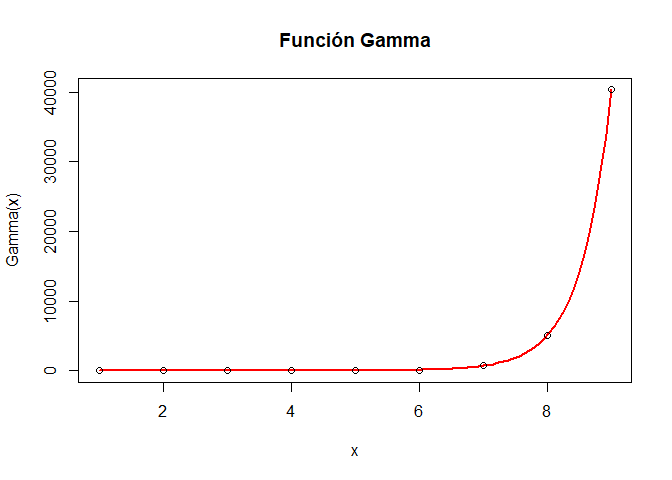

# Lab2

En esta asignatura entrenaremos *cosas* de matemáticas y sus amigos.

## La función Gamma

La función Gamma $\Gamma$ tiene diversas definiciones en la matemática.
La definición que utilizaremos es:

$$ \Gamma(z)= \int_0^{\infty} x^{z-1} \cdot e^{-x}  dx, \mbox{ donde } z\in \mathbb{R}.$$


Resolvamos esta integral en el caso    $\Gamma(z+1)$ con  $z\in \mathbb{R}$. Recordemos que  la fórmula integración por partes en este caso es:


$$\int_{0}^{\infty} u \cdot d v =\left[u\cdot v \right]_0^\infty-\int_0^{\infty} v \cdot du.$$

Apliquemos el método de integración por partes a la función $\Gamma$

$$
\begin{aligned}
\Gamma(z+1) &=  \int_0^{\infty} x^{z} \cdot e^{-x}dx= 
\left|
\begin{matrix} u=x^{z}  & dv= e^{-x}\cdot  dx 
\\ du= z \cdot x^(z+1)  & v=-e^{-x} 
\end{matrix}
\right|
\\
&=\left[-x^z\cdot e^{-x}\right]_0^\infty
-\int_0^{\infty} z\cdot x^{z-1} \cdot \left(-e^{-x}\right)\cdot  dx
\\
&=
\lim_{x\to\infty}\left(-x^z\cdot e^{-x}\right)
+
z\cdot \int_0^{\infty} x^{z-1} \cdot e^{-x}\cdot dx.
\end{aligned}
$$

como

$$\lim_{x\to\infty}\left(-x^z\cdot e^{-x}\right)=0$$

tenemos que 

$$\Gamma(z+1)= 
z\cdot \int_0^{\infty} x^{z-1} \cdot e^{-x}\cdot  dx=z\cdot \Gamma(z).
$$

Por lo que hemos encontrado una fórmula recursiva, en al que si queremos saber $\Gamma(z+1)$ tenemos que  saber que vale $\Gamma(z)$ y utilizar la fórmula anterior.

Además 

$$\Gamma(1)=\int_0^{\infty} x^{1-1} \cdot e^{-x}  dx=\int_0^{\infty}  e^{-x}  dx=
\left[-e^{-x}\right]_{0}^{\infty}=\lim_{x\to \infty} -e^{-x}- \left( -e^{-x}\right)=0-(-1)=1.$$


Por lo tanto $si $n\in\mathbb{N}$

* $\Gamma(1)=1.$
* $\Gamma(2)=2 \cdot \Gamma(1)=2\cdot 1.$
* $\Gamma(3)= 3 \cdot\Gamma(2)= 3 \cdot 2 \cdot \Gamma(1)= 3\cdot 2 \cdot 1.$
* $\ldots$
* $\Gamma(n)= n \cdot\Gamma(n-1)= n \cdot (n-1) \cdot \Gamma(n-2)=\ldots=n\cdot (n-1)\ldots 2\cdot 1=n!.$


## Las fórmulas recursivas


La fórmulas recursivas son las que dependen de un valor anterior al que se calcula. La más popular es el factorial


La definición de factorial de un  número natural $n\in\mathbb{N}$,  es ¡¡obviamente!! recursiva

$$
\begin{aligned}
\verb+factorial+ = n!: & \mathbb{N} \longrightarrow  \mathbb{N}\\
& n \longrightarrow  n\cdot (n-1)\cdot (n-2) \ldots \cdot 3\cdot 2\cdot 1.
\end{aligned}
$$

Se define con estas reglas:


1. `factorial(0)`=$0!=1$. 
2. `factorial(n+1)=`$(n+1)!=(n+1)*factorial(n).$


En la notación matemática, como ya sabéis el factorial se representa con  el símbolo de exclamación/admiración; así 


1. `factorial(0)`:= $0!=1$.
2. `factorial(n+1)`:= $(n+1)!=(n+1)\cdot n!$.


Así tenemos que 

* $0!=1.$
* $1!=1.$
* $2!= 2\cdot 1= 2.$
* $3!=3\cdot 2\cdot 1= 6.$
* $4!=4\cdot 3\cdot 2\cdot 1 =24.$
* $\ldots \ldots$
* $n!= n\cdot (n-1) \cdot (n-2) \cdots 3\cdot 2\cdot 1.$
* $(n+1)!=  (n+1)\cdot n!= (n+1)\cdot n\cdot (n-1) \cdot (n-2) \cdots 3\cdot 2\cdot 1.$


En R la función factorial es `factorial(n)` para un $n\in\mathbb{N}$, mientras que  la función $Gamma$ es `gamma(z)` para un $z\in\mathbb{R}$.


```r
factorial(0:10)
```

```
##  [1]       1       1       2       6      24     120     720    5040   40320
## [10]  362880 3628800
```

```r
gamma((1:10)+1)
```

```
##  [1]       1       2       6      24     120     720    5040   40320  362880
## [10] 3628800
```

```r
factorial(1:10)==gamma((1:10)+1)
```

```
##  [1] TRUE TRUE TRUE TRUE TRUE TRUE TRUE TRUE TRUE TRUE
```

```r
all(factorial(1:10)==gamma((1:10)+1))
```

```
## [1] TRUE
```

```r
gamma(1/2)
```

```
## [1] 1.772454
```

```r
sqrt(pi)
```

```
## [1] 1.772454
```

```r
gamma(1/2)==sqrt(pi)
```

```
## [1] FALSE
```

```r
dplyr::near(gamma(1/2),sqrt(pi))
```

```
## [1] TRUE
```

```r
gamma(1/2)-sqrt(pi)
```

```
## [1] 2.220446e-16
```


# Gráfica función Gamma en los reales


Así la gráfica de la función gamma pasa por todos los pares $(n,(n-1)!)$ para todo $n \in \mathbb{N}.$


```r
curve(gamma(x),xlim=c(1,9),col="red",ylab="Gamma(x)",lwd=2,frame.plot=TRUE,main="Función Gamma")
#axis(2, at = gamma(1:9),labels = gamma(1:9) )
points(x = 1:9,y=factorial(0:8))
```

<!-- -->

```r
gamma(1:10)
```

```
##  [1]      1      1      2      6     24    120    720   5040  40320 362880
```


