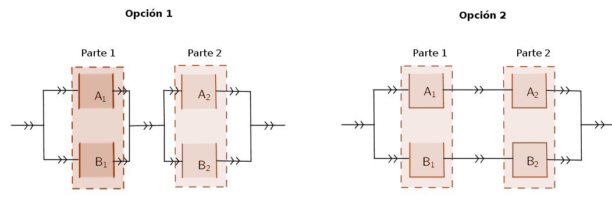

```{r setup, include=FALSE}
knitr::opts_chunk$set(echo = TRUE)
```

# Taller 1 Probabilidad

## Enunciado

Supongamos que tenemos un motor con dos partes diferenciadas: $P_1$ y $P_2$: por ejemplo, P1 activa la bomba de gasolina en el depósito y P2 la enciende para iniciar la combustión. Para garantizar que nuestro motor funciona, decidimos poner dos interruptores, dos en P1 y dos en P2 que activan la bomba de gasolina y la combustión respectivamente. Se nos presentan dos formas de configurar estas partes:

-   Opción 1: Tanto $P_1$ como $P_2$ tiene sus dos interruptores conectados en paralelo. De forma que los dos interruptores de $P_1$ se encuentran en serie con los dos de $P_2$ Es decir, para que el motor funcione, se debería poner en marcha un interruptor de $P_1$ cualquiera, y un interruptor de $P_2$ cualquiera.

-   Opción 2: Conectamos en serie un interruptor de $P_1$ y uno de $P_2$ , y en paralelo a estos dos un nuevo interruptor de $P_1$ en serie con otro de $P_2$. En este caso, para que el motor se ponga en marcha debería actuar correctamente el interruptor de $P_1$ del primer circuito a la vez que el de $P_2$ del primer circuito o bien el segundo interruptor de $P_1$ junto con el segundo de $P_2$

Los interruptores funcionan con una probabilidad $p$ fijada y de forma independiente. La pregunta es ¿cuál de las dos configuraciones es la más recomendable para instalar en nuestro motor en función del parámetro $p$? Necesitaremos una justificación matemática del hecho, pero se puede combinar con un resultado numérico (por ejemplo, para ciertos valores de $p$, dar las probabilidades de los dos circuitos y ver si, a partir de cierto valor es más recomendable una configuración u otra).

Indicación: utilizar los esquemas que se dan a continuación para visualizar las dos opciones de configuración del motor

## Esquemas



## Solución

Lo resolveremos de dos maneras, la primera es más elegante y algebraica, la segunda es numérica.

###Solución 1 Denotemos por $A_1$, $A_2$, $B_1$ y $B_2$ los sucesos en los que los respectivos interruptores funcionan por lo tanto $P(A_i)=P(B_i)=p$ para $i=1,2$. Suponemos que estos sucesos son independientes. Denotemos por $OP_i$ al suceso las opción $i$ funciona para $i=1,2$.

Estos sucesos se pueden escribir en términos de los funcionamientos de los interruptores tal y como escribimos a continuación

$$OP_1=(A_1\cup B_1)\cap (A_2\cup B_2) \mbox{ y } OP_2=(A_1\cap A_2)\cup (B_1\cap B_2)$$

La pregunta fundamental del problema es qué opción de configuración es más fiable, es decir, cuál tiene mayor probabilidad de funcionar.

La respuesta más sencilla es demostrar que el suceso $OP_2$ está contenido en $OP_1$. Es sencillo ya que $(A_1\cap A_2)\subseteq A_1\subseteq (A_1\cup B_1)$ y del mismo modo $(B_1\cap B_2)\subseteq B_2\subseteq (A_2\cup B_2)$. Por lo tanto

$$OP_2=(A_1\cap A_2)\cup (B_1\cap B_2) \subseteq (A_1\cup B_1)\cap (A_2\cup B_2)= OP_1$$ y aplicando la monotonía de la probabilidad tenemos que si $OP_2\subseteq OP_1$ entonces $P(OP_2)\leq P(OP_1)$

Así que la configuración de la opción 2 tiene siempre la misma (o igual) probabilidad de funcionar que la de la opción 1. Notemos que no hemos utilizado que las probabilidades de funcionamiento de los interruptores sean iguales a $p$ , así que el resultado sería cierto si cada interruptor funciona con una probabilidad distinta, ni tampoco hemos utilizado la independencia.

### Solución 2

Utilizaremos las mismas notaciones que en la solución 1. Ahora atacaremos el problema calculado la probabilidad de $OP_1$ y $OP_2$

$$
\begin{aligned}
P(OP_1) & =P((A_1\cup B_1)\cap (A_2\cup B_2))=1-P\Big(\big[(A_1\cup B_1)\cap (A_2\cup B_2)\big]^c\Big) \\
 & =1-P\left((A_1^c\cap B_1^c)\cup (A_2^c\cap B_2^c)\right)\\
 &=1-\left( P(A_1^c\cap B_1^c)+P(A_2^c\cap B_2^c)-P(A_1^c\cap B_1^c\cap A_2^c\cap B_2^c)\right)\\
 & =1-\Big(P(A_1^c)\cdot P(B_1^c)+P(A_2^c)\cdot P(B_2^c)- P(A_1^c) \cdot P(B_1^c) \cdot P(A_2^c) \cdot P(B_2^c)\Big)\\
 & =1-\left((1-p)^2+(1-p)^2-(1-p)^4\right)= 1- 2 \cdot (1-p)^2 + (1-p)^4.\\
\end{aligned}
$$

Ahora de forma similar con la configuración 2

$$
\begin{aligned}
P(OP_2) & =P\left((A_1\cap A_2)\cup (B_1\cup B_2)\right)=P(A_1\cap A_2)+P(B_1\cup B_2)-P(A_1\cap A_2\cap B_1\cap B_2)\\
  &=P(A_1)\cdot P(A_2)+P(B_1)\cdot P(B_2)- P(A_1) \cdot P(B_1) \cdot P(A_2) \cdot P(B_2)\\
 & = p^2+p^2-p^4=2\cdot p^2-p^4.\\
\end{aligned}
$$

Definamos, con `R` dos funciones que nos calculen la fiabilidad (probabilidad de funcionamiento) de cada uno de las dos configuraciones del motor:

```{r}
ProbOp1=function(p) 1-2*(1-p)^2+(1-p)^4
ProbOp2=function(p) 2*p^2-p^4
```

Dibujemos ambas curvas con las decoraciones adecuadas (colores, leyenda, etiquetas de los ejes, etc.)

```{r}
curve(ProbOp1(x),col="red",xlim=c(-0.2,1.2),
      xlab=paste("Valor de ",expression("p"),collapse=" "),
      ylab="Probabilidad de funcionamiento", main="Fiabilidad de las dos configuraciones.")
curve(ProbOp2(x),add=TRUE,col="blue")
legend(x="topleft",legend=c("Probabilidad opción 1",
                            "Probabilidad opción 2"),col=c("red","blue"),pch = 19)
```

Pero no es suficiente, podemos hacer más. Por ejemplo la configuración en serie de los dos interruptores en paralelo podría ser más cara pues necesita dos conexiones adicionales.

Necesitamos dibujar la curva de la mejora de la probabilidad de funcionamiento de la opción 1 contra la 2:

```{r}
curve(ProbOp1(x)-ProbOp2(x),col="red",xlim=c(-0.2,1.2), ylim=c(0,0.2),xlab=paste("Valor de ",expression("p"),collapse="p"),ylab="Incremento de la probabilidad de funcionamiento",main=" Ganancia en fiabilidad  \n de la OP1 sobre la OP2")
```

Pero además podemos calcular esto numéricamente.

La pregunta es ¿cuándo $P(OP_1)\geq P(OP_2)$? Para ello definamos

$$Dif(p)=P(OP_1)-P(OP_2)= 1- 2 \cdot (1-p)^2 + (1-p)^4-\left( 2\cdot p^2-p^4\right)$$.

Operando obtenemos que

$$
\begin{aligned}
Dif(p) 
  & =P(OP_1)- P(OP_2)= 1- 2 \cdot (1-p)^2 + (1-p)^4-\left( 2\cdot p^2-p^4\right)\\
  & = 1- 2 (1-2 \cdot p + p^2) +1-4\cdot p +6\cdot p^2-4 \cdot p^3+p^4 -2 \cdot p^2+ p^4- 2\cdot p^2+p^4=\\
  & = 2\cdot p^2-4 p^2 +2\cdot p^3= 2\cdot p^2 (1-2\cdot p+p^2)\\
  & = 2\cdot p^2 (1-p)^2.
\end{aligned}
$$

Como $Dif(p)$ es una función continua para saber cuando es positiva resolvemos la desigualdad

$$Dif(p)=2\cdot p^2 (1-p)^2>0.$$ La soluciones corresponden a las de las ecuaciones

$$
\left\{
\begin{aligned}
& p^2=0\\
& (1-p)^2=  0\\
\end{aligned}
\right.
$$

que son $p=0$ y $p=1$. Como $Dif\left(\frac{1}{2}\right)= 2 \left(\frac{1}{2}\right)^2 \cdot \left(1-\frac{1}{2}\right)^2=`r ProbOp1(1/2)-ProbOp2(1/2)`> 0$ tenemos que $Dif(p)>0$ para todo $p$ tal que $0<p<1$.

Los candidatos a diferencia máxima se alcanza en los valores de $p$ tales que

$$(Dif(p))'= 4\cdot p (1-p)^2-4\cdot p^2\cdot(1-p)= 4\cdot p-12\cdot p^2+8\cdot p^3 $$

La soluciones son $p=0,1,\frac{1}{2}$. Calculemos la segunda derivada

$$(Dif(p))''= 4-24\cdot p+24\cdot p^2$$

Podemos averiguar sin los candidatos a puntos singulares son máximos mínimos o puntos de inflexión estudiando si la segunda derivada es positiva o negativa en los puntos adecuados.

$$
\begin{aligned}
 (Dif(-1))'' & = `r 4-24* (-1)+24*(-1)^2`>0\\
 (Dif(0))'' & =  `r 4-24* (0)+24*(0)^2`>0\\
\Big(Dif\left(\frac{1}{2}\right)\Big)'' & =  `r 4-24* (1/2)+24*(1/2)^2`<0\\ 
(Dif(1))'' &= `r 4-24* (1)+24*(1)^2`>0\\
 (Dif(2))'' & =   `r 4-24* (2)+24*(2)^2`>0\\
\end{aligned}
$$ Dejamos al lector los detalles pero el máximo se alcanza en $p=\frac{1}{2}$ y su valor es $Dif\left(\frac{1}{2}\right)=`r ProbOp1(1/2)-ProbOp2(1/2)`$
